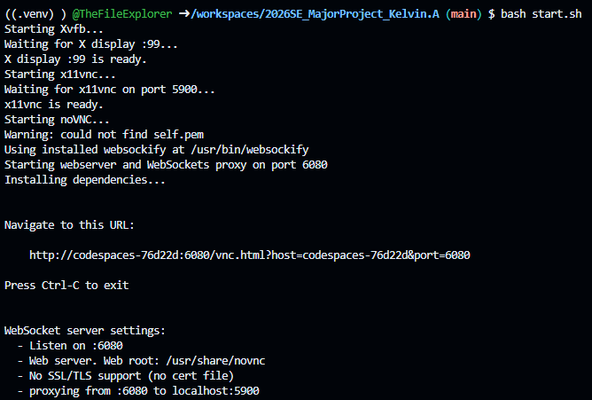
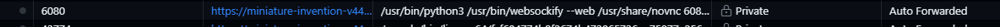
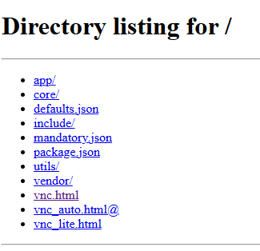
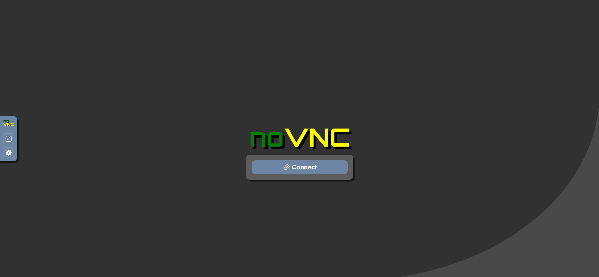
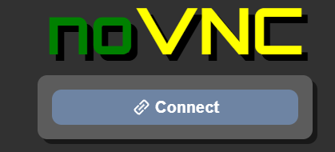

# 2026SE Major Project — Turn-Based Samurai Combat

A turn-based RPG combat prototype built with Python and pygame-ce, inspired by Final Fantasy-style battles. The player controls a samurai facing two enemies (Gintoki and Sakata) and can attack, defend, or drink potions on their turn, with randomised attack animations, damage/heal floating text, a turn indicator, and match results (win/loss and remaining HP) logged to a SQLite database for future balancing.

## Status

- **Current sprint:** Sprint 8 (final sprint of the project)

- **Last increment:** Refactored the single-file prototype into separate modules (`core/`, `entities/`, `scripts/`, `utilities/`) for rendering, game state, collision/input, spawning, and resource loading, while preserving existing gameplay behaviour (PB-14, PB-15).

- **Next planned increment:** No further sprints are scheduled — Sprint 8 was marked as the last. Remaining work is bug-fix only, tracked in `BUG_TRACKER.md`: cursor visibility not reliably hiding over VNC (BUG-002) and residual katana cursor lag over VNC (BUG-005).

## How to Run

### Environment

Run this project inside the provided Dev Container (`.devcontainer/devcontainer.json`).

The container automatically sets up:

- Xvfb
- x11vnc
- noVNC
- Python virtual environment (via `postCreateCommand`)

### Quick Start

1. Open the project in VS Code and wait for `postCreateCommand` to finish.
2. Open a `bash` terminal.
3. Start the game:

```bash
bash start.sh
```



### Connect to the Game (noVNC)

1. Wait for port `6080` to appear in the VS Code Ports tab.
2. Open port `6080` in your browser.
3. Open either `vnc.html` or `vnc_auto.html`.
4. Click **Connect**.
5. Switch to fullscreen for the best experience.

> [!NOTE]
> NEVER share the public link with anyone










> [!NOTE]
> `start.sh` creates the virtual environment and installs `requirements.txt` automatically if needed. You do not need to run `pip install` manually.

## Project Planning

- Product Backlog — user stories, priorities, and acceptance criteria
- Sprint Backlog — sprint goals, plans, test summaries, and retrospectives

## Licence

This project is licensed under the GNU General Public License v3.0 (GPL-3.0).

See the full license text in [LICENSE](LICENSE).

## How Others Can Use This Code

You are welcome to use, study, modify, and redistribute this code under the terms of GPL-3.0.

If you share modified versions, you must:

1. Keep the same GPL-3.0 license.
2. Include the original copyright and license notices.
3. Make the source code for your distributed version available.
4. Clearly mark significant changes you made.

For complete legal terms, refer to [LICENSE](LICENSE).

## Acknowledgements

- **Client:** for iterative gameplay feedback across sprints.
- **Teacher:** Mr Jones for development guidance and review support.
- **Open-source libraries used:**
  - [pygame-ce](https://github.com/pygame-community/pygame-ce)
  - Python standard library modules, including `sqlite3` for match result storage.
